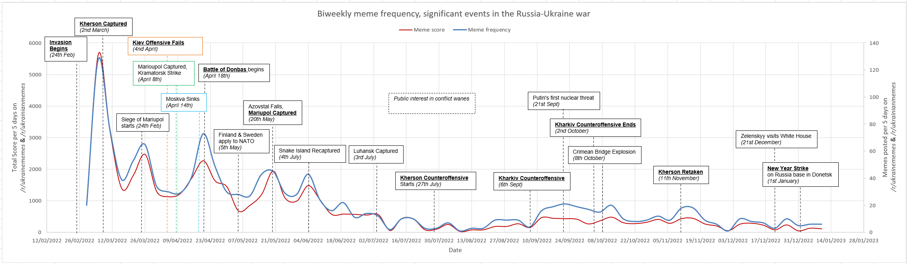

# ukraine_meme

This graph demonstrates some interesting observations about meme campaign about the War in Ukraine:

- The meme campaign seems to be more pronounced during the initial half of the war (Feb-Aug 2022) at which public interest waned. This suggests
That the meme campaign is more "informal" or crowd-sourced rather than "formalized" or centralized among Ukrainian leaders.

- Second, the meme campaign seems to be a supporting effort to lethal operations (e.g., Kiev Offensive, Battle of Donbas, Kharkiv Counteroffensive, etc).
This seems to reinforce SHAPE's - Supreme Headquarters Allied Powers Europe - recent comments at the security forum in Sweden that "hard power is a reality."

- Third, the meme campaign seems to be targeted against domestic and regional audiences, 
including the Russian military and people, rather than international audiences, 
though this is an epiphenomenal outcome. Look, for instance, at the lack of
memes around one of the most political events of the war - Ukrainian President Zelinsky's 
visit to the White House in late December 2022. Or, the lack of a spike after Sweden and Finland
lobbied to join NATO in mid-May 2022. On the other hand, take a look at the spike in memes
following the Kharkiv Counteroffensive, again suggesting the target audiences are Ukrainians - to build will - and Russian people - to defeat will.

- Fourth, this all suggests that leaders should capitalize on the 
informal/crowdsourced meme campaign by shaping or influencing it
immediately following - or even during - a key phase of the campaign. 
It's an additive or multiplicative tool, in the vein of combined arms maneuver, rather than a silver-bullet. 
